# Gestión de Configuración y Automatización sobre Ghost

Implementación de una estrategia de control de versiones y automatización (DevOps)
sobre tres configuration items del sistema Ghost.

**Universidad de La Sabana**
Gestión de Configuración y Mantenimiento de Software
Docente: César Augusto Vega Fernández

**Equipo:** Natalia Rodríguez, Jose Haider Barreto, Sergio López

---

## 1. Introducción

Este repositorio implementa la estrategia de gestión de configuración diseñada en
las unidades anteriores del curso, llevándola de un plan documental a controles
automatizados y verificables sobre un sistema real.

El trabajo se apoya en dos entregas previas. En la Unidad 1 se realizó el
diagnóstico de mantenimiento y evolución de Ghost, donde se identificaron como
problemas principales la migración inconclusa de su panel de administración entre
dos frameworks de frontend, los cambios recurrentes en los requisitos de versión
de Node.js sin ventanas de compatibilidad solapadas, y el acoplamiento con la
versión de la base de datos. En la Unidad 2 se diseñó el plan de gestión de
configuración siguiendo el estándar IEEE 828-2012, identificando los
configuration items del sistema, sus baselines, el proceso de control de cambios
y los mecanismos de trazabilidad.

Esta tercera unidad materializa ese plan. El reto abordado es cómo implementar
una estrategia de control de versiones y automatización que permita gestionar
eficientemente la evolución del software, y la respuesta que propone este
repositorio consiste en llevar las políticas acordadas por el equipo a controles
ejecutables: pipelines que validan, bloquean y publican de forma automática, sin
depender de que cada integrante recuerde las reglas.

**Estado del repositorio antes de iniciar el trabajo:**


*Tres ramas, cero tags, ningún release publicado. Es la baseline de comparación
del resto de este documento.*

---

## 2. Configuration items gestionados

Se gestionan tres configuration items de naturaleza distinta, lo que permite
demostrar que la estrategia se adapta a artefactos con ciclos de vida diferentes.

| CI | Carpeta | Tipo | Responsable |
|----|---------|------|-------------|
| CI-1 | `casper/` | Tema de Ghost | Sergio López |
| CI-2 | `source/` | Tema de Ghost | Jose Haider Barreto |
| CI-3 | `config-entorno/` | Infraestructura como código | Natalia Rodríguez |

**CI-1 y CI-2** son los dos temas oficiales de Ghost. En el monorepo del proyecto
figuran como submódulos de Git, es decir, como codelines de terceros según la
terminología de Berczuk y Appleton (2002). Ambos conservan su versionamiento
semántico propio, heredado del proyecto original: Casper en la versión 5.12.1 y
Source en la 1.7.1.

**CI-3** es de elaboración propia y responde directamente a una brecha detectada
en el diagnóstico de la Unidad 2: Ghost no publica una plantilla versionada que
declare qué variables de entorno son obligatorias en cada versión mayor. Esa
ausencia contribuye a los fallos de despliegue documentados en la Unidad 1, donde
actualizaciones de infraestructura se realizan sin conocer los requisitos exactos
de la versión instalada.

La procedencia detallada de cada CI está documentada en
[`PROCEDENCIA.md`](PROCEDENCIA.md).


*Los tres configuration items conviviendo en el repositorio, cada uno en su
propia carpeta.*

---

## 3. Estructura del repositorio

```
gestion-configuracion-ghost/
├── casper/                  CI-1: tema por defecto de Ghost
├── source/                  CI-2: segundo tema oficial de Ghost
├── config-entorno/          CI-3: infraestructura como código
│   ├── .env.example         Plantilla versionada de variables
│   ├── .gitignore           Impide versionar valores reales
│   ├── Dockerfile           Imagen con versiones fijadas
│   ├── compose.yaml         Servicios de Ghost y MySQL
│   └── scripts/
│       └── validate-env.sh  Validación de variables requeridas
├── .github/workflows/       Los siete workflows de CI/CD
├── .gemini/
│   └── styleguide.md        Guía de revisión para el agente de IA
├── docs/
│   ├── pipelines-temas.md   Documentación técnica de los CI-1 y CI-2
│   └── evidencias/          Capturas de la ejecución real
├── AGENTS.md                Política de gobernanza para agentes de IA
├── PROCEDENCIA.md           Origen y versión base de cada CI
└── README.md                Este documento
```

---

## 4. Estrategia de branching

Se adoptó **GitFlow** como estrategia de ramificación.

```
main                    Versiones publicadas. Rama protegida.
 └── develop            Integración continua. Rama protegida.
      ├── feature/*     Trabajo nuevo
      └── ...
 └── release/vX.Y.Z     Preparación de versión
 └── hotfix/*           Correcciones urgentes sobre main
```

### Justificación de la elección

Ghost, el proyecto del que provienen dos de los tres CI, utiliza GitHub Flow: una
única rama principal con ramas de característica de vida corta. Esa elección es
coherente con su contexto, ya que se trata de un proyecto de código abierto con
contribuciones externas continuas y despliegue frecuente, donde reducir la
fricción de integración es prioritario.

El equipo optó deliberadamente por GitFlow en lugar de replicar esa práctica. La
razón es que el objeto de trabajo es distinto: aquí se gestionan artefactos
versionados y publicados por lotes, con releases identificables, donde el
aislamiento que ofrece una rama de preparación de versión aporta un punto de
control adicional antes de publicar. Esta decisión ilustra un principio del
propio estándar IEEE 828 (IEEE, 2012): la estrategia de configuración se adapta
al contexto del proyecto y no se hereda automáticamente del sistema analizado.


*Historial completo con `main`, `develop` y el tag `v1.0.0` sobre el mismo
commit tras el release, y las ramas de característica convergiendo mediante
merges visibles.*

### Protección de ramas

Tanto `main` como `develop` están protegidas mediante rulesets que exigen pull
request con al menos una aprobación antes de integrar. Ningún integrante, incluida
la propietaria del repositorio, puede realizar push directo sobre ellas. Esto
convierte la estrategia de branching en un control efectivo y no en una
declaración documental.


*Los rulesets `proteccion-main` y `proteccion-develop`, ambos activos con tres
reglas cada uno.*

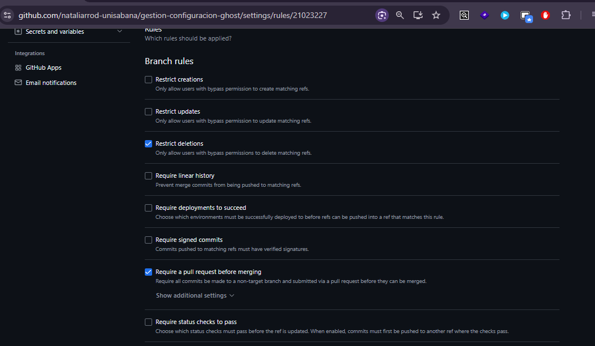
*Las reglas del ruleset `proteccion-main`: exigencia de pull request antes de
integrar y restricción de eliminación de la rama. El número de aprobaciones
requeridas se configura dentro de los ajustes adicionales de la primera regla.*

El control se verificó incluso en el propio pull request de release: al no tener
aún la aprobación requerida, el merge quedó bloqueado a pesar de que los ocho
checks automatizados ya estaban en verde.

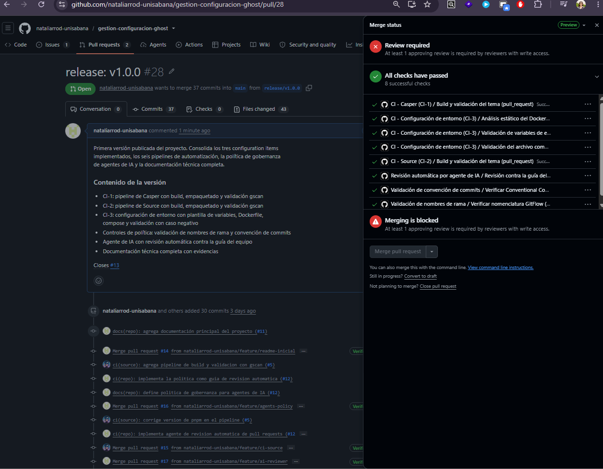
*Todos los controles automatizados aprobaron el cambio, pero la regla de
aprobación humana impidió el merge hasta contar con una revisión.*

La nomenclatura de las ramas no queda librada a la disciplina individual: el
pipeline `branch-lint.yml` la verifica automáticamente en cada pull request y
bloquea la integración cuando un nombre no cumple el patrón acordado.


*El control rechazando un nombre de rama que no sigue la convención `feature/`,
`release/` o `hotfix/`.*

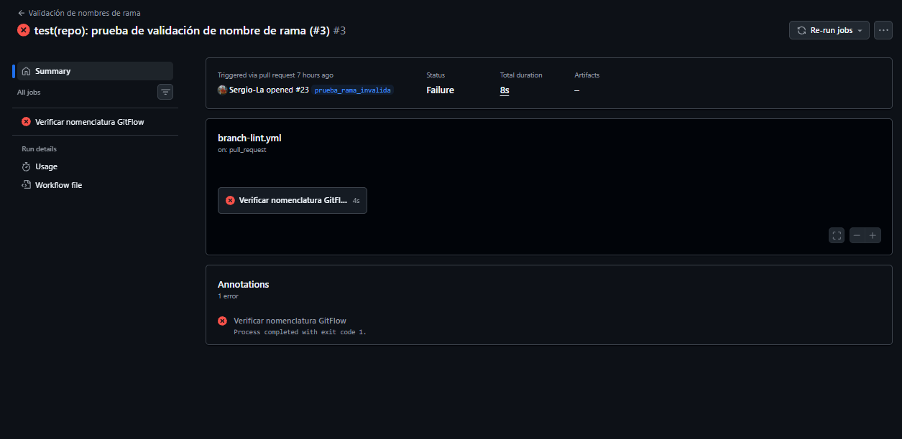
*El job terminando con exit code 1 sobre una rama de prueba creada
deliberadamente con un nombre inválido.*

---

## 5. Versionamiento semántico

El repositorio se versiona como conjunto mediante tags `vX.Y.Z`:

| Componente | Criterio | Ejemplo |
|------------|----------|---------|
| MAYOR | Cambio que rompe compatibilidad | Modificar la versión mínima de Node.js requerida |
| MENOR | Funcionalidad nueva sin romper compatibilidad | Incorporar un nuevo configuration item |
| PARCHE | Corrección sin cambio funcional | Ajustar un paso de un pipeline existente |

Coexisten dos niveles de versionamiento, lo cual es en sí mismo un hallazgo
relevante: el repositorio del equipo mantiene su propia secuencia de versiones,
mientras que cada tema conserva la suya, heredada de Ghost. Esto refleja lo
señalado en la Unidad 2 sobre configuration items con ciclos de vida
independientes, donde el ritmo de publicación de un componente no está atado al
del conjunto que lo contiene.

La primera versión publicada es **v1.0.0**, que marca la baseline del estado
completo de la implementación.


*El tag publicado sobre el commit de integración del release, con sus enlaces de
descarga del código fuente.*

El proceso de publicación está automatizado en `release.yml`, que al detectar un
tag construye los artefactos de ambos temas y crea la release con los paquetes
adjuntos.


*La release v1.0.0, publicada automáticamente por `github-actions`, con las
notas de versión generadas a partir del historial de cambios.*

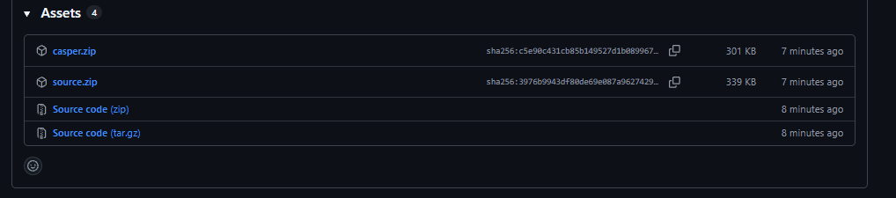
*Los archivos `casper.zip` y `source.zip` disponibles para descarga, cada uno
con su digest sha256 de verificación.*


*Ejecución del workflow de release, disparada automáticamente por el push del
tag `v1.0.0`, finalizando en verde.*

---

## 6. Convención de commits

Se adoptó **Conventional Commits** con el siguiente formato:

```
<tipo>(<alcance>): <descripción> (#<issue>)
```

| Elemento | Valores permitidos |
|----------|-------------------|
| Tipo | `feat`, `fix`, `docs`, `ci`, `build`, `test`, `refactor`, `chore` |
| Alcance | `casper`, `source`, `config`, `docs`, `repo` |
| Issue | Número del issue asociado |

Ejemplo:

```
ci(config): agrega pipeline de validación del entorno (#10)
```

La referencia al número de issue es el mecanismo central de trazabilidad del
proyecto: vincula cada cambio en el código con la solicitud que lo originó, con
la discusión asociada y con la aprobación que lo autorizó.

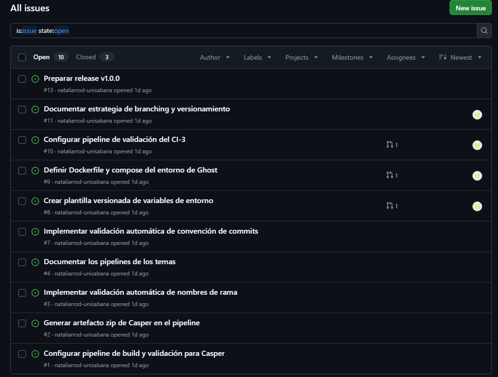
*Los issues del proyecto, cada uno enlazado con el pull request que lo resuelve.*


*Siete commits del CI-3, cada uno con propósito único y su issue asociado.*


*Un issue vinculado a sus commits, al pull request que lo resuelve, y cerrado
automáticamente al integrarse.*

El pipeline `commit-lint.yml` verifica el cumplimiento del formato y bloquea la
integración cuando algún commit no lo respeta.

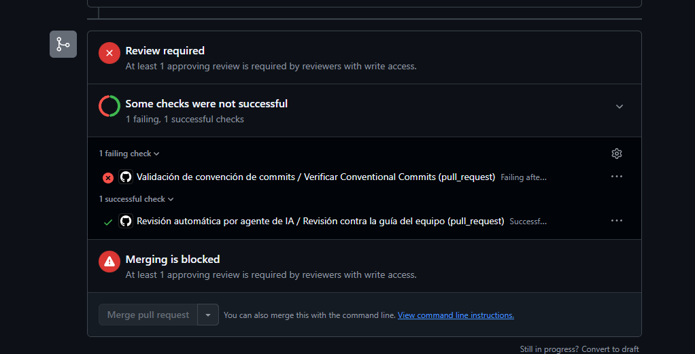
*El check de convención de commits en estado de fallo dentro de un pull
request.*


*Log del rechazo de un commit con el mensaje "cambios varios", indicando el
formato esperado.*

---

## 7. Pipelines de integración y entrega continua

El repositorio cuenta con siete workflows de GitHub Actions.

| Workflow | Función | CI asociado |
|----------|---------|-------------|
| `ci-casper.yml` | Build, empaquetado y validación con gscan | CI-1 |
| `ci-source.yml` | Build, empaquetado y validación con gscan | CI-2 |
| `ci-config-entorno.yml` | Análisis del Dockerfile, sintaxis del compose y validación de variables | CI-3 |
| `branch-lint.yml` | Verificación de la nomenclatura de ramas | Todos |
| `commit-lint.yml` | Verificación de la convención de commits | Todos |
| `ai-review.yml` | Revisión automática contra la guía del equipo | Todos |
| `release.yml` | Publicación de la versión con sus artefactos | Todos |


*Los siete pipelines listados en la pestaña Actions del repositorio, incluido el
de Release.*

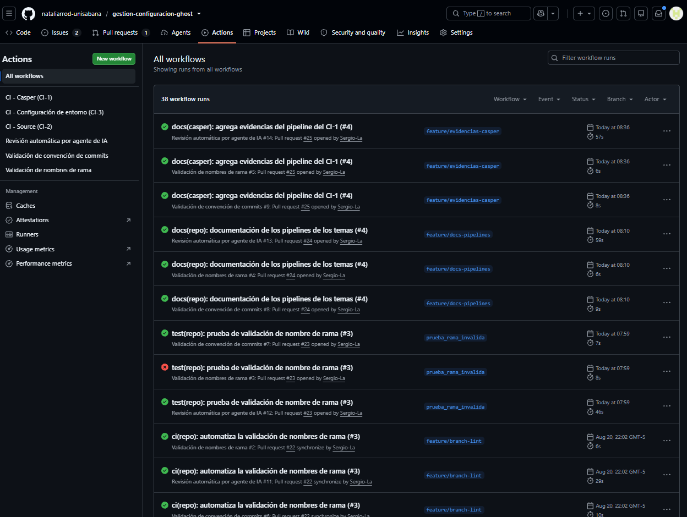
*Historial acumulado de ejecuciones, con el workflow, la rama y el autor
identificables en cada una.*

### Dos categorías de automatización

Los pipelines del proyecto responden a dos propósitos distintos.

Los tres primeros son **controles técnicos**: compilan, empaquetan y validan que
cada artefacto sea correcto según las reglas de su propia tecnología. Cada uno se
activa únicamente cuando cambia la carpeta de su configuration item, mediante
filtros por ruta, lo que mantiene la independencia entre los CI y evita
ejecuciones innecesarias.


*Los tres jobs del CI-3 y el del agente de IA, todos exitosos.*

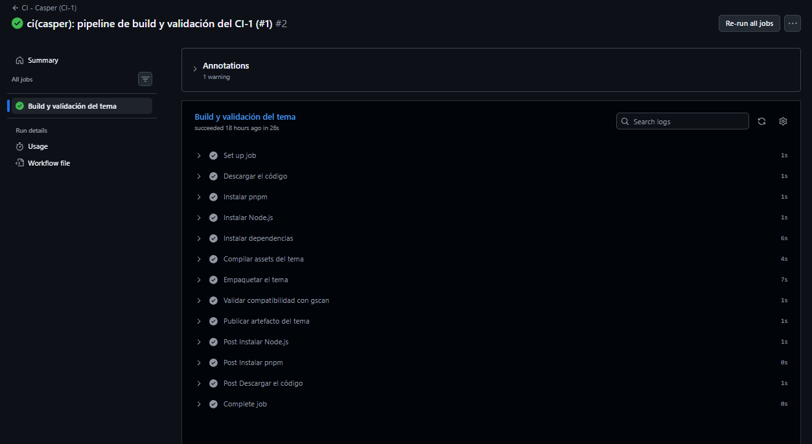
*Los pasos del job del CI-1, desde la instalación de dependencias hasta la
validación de compatibilidad con gscan.*

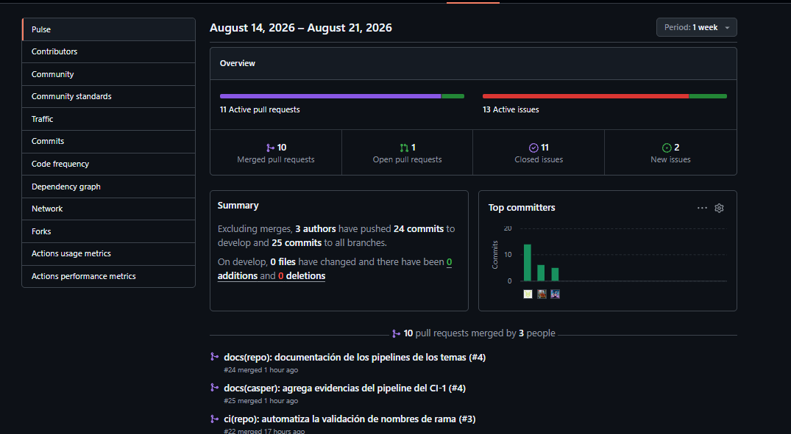
*Ejecuciones del pipeline de Casper, tanto sobre la rama `feature/ci-casper`
como sobre `develop` tras el merge.*


*El artefacto `casper-theme`, con su tamaño y digest sha256.*

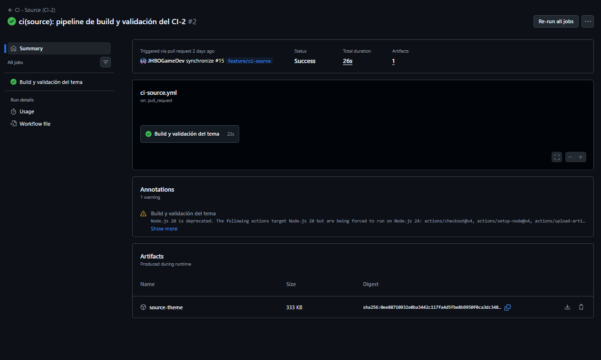
*El artefacto `source-theme`, generado por el pipeline del CI-2.*

Los pipelines `branch-lint` y `commit-lint` son **controles de política**: no
verifican el artefacto sino el cumplimiento de las reglas que el propio equipo
definió. Esta distinción es relevante desde la perspectiva de gestión de
configuración, porque convierte acuerdos documentales en restricciones ejecutables.
Una convención escrita en un documento depende de que cada persona la recuerde y
la aplique; la misma convención implementada como pipeline se cumple siempre, y
su incumplimiento queda registrado. Es la diferencia entre un control preventivo
declarado y uno efectivo.

El caso del CI-3 incorpora además un **caso negativo deliberado**: el pipeline no
solo verifica que el script de validación acepte un archivo de variables completo,
sino que comprueba que efectivamente rechace uno incompleto. Una automatización
que solo se prueba en el escenario favorable no demuestra que controle nada.

La documentación técnica detallada de los pipelines de los temas está en
[`docs/pipelines-temas.md`](docs/pipelines-temas.md).

---

## 8. Gobernanza de agentes de IA

El repositorio incorpora una política explícita sobre la participación de agentes
de inteligencia artificial en el flujo de trabajo, documentada en
[`AGENTS.md`](AGENTS.md), y la implementa como control ejecutable.

### El planteamiento

El punto de partida es una observación del propio proyecto Ghost: sus
repositorios ya incluyen archivos de documentación dirigidos a agentes
automatizados. Desde la perspectiva de gestión de configuración, esto plantea una
pregunta que el estándar IEEE 828 no anticipa, ya que un agente capaz de proponer
o modificar código es un actor dentro del proceso de control de cambios y, por
tanto, requiere un rol y unos permisos definidos igual que un desarrollador
humano.

La política adoptada permite que los agentes revisen y sugieran, pero reserva a
las personas la autoridad de aprobación e integración.

### La implementación

Se implementó un workflow propio, `ai-review.yml`, que en cada pull request envía
el conjunto de cambios y la guía de revisión del equipo a un modelo de lenguaje, y
publica el resultado como comentario. Tres decisiones de diseño traducen la
política a comportamiento verificable:

- **El agente comenta pero no aprueba.** Publica un comentario de conversación y
  no una revisión con estado de aprobación, de modo que no puede satisfacer el
  requisito de aprobación de las reglas de protección de rama.
- **Su fallo no bloquea la integración.** Los errores se manejan como
  advertencias y nunca hacen fallar el job, porque su resultado es consultivo y
  no debe condicionar el merge.
- **Lee `.gemini/styleguide.md` en tiempo de ejecución.** Las reglas no están
  embebidas en el workflow, de modo que un cambio en las convenciones del equipo
  se refleja sin modificar el pipeline. Es la misma lógica de fuente única de
  verdad aplicada al control automatizado.

### Resultados y evaluación crítica

El agente produjo hallazgos de valor desigual a lo largo del proyecto, y su
evaluación es parte del proceso.


*El agente evaluando el CI-3 contra las cinco reglas del `styleguide.md`.*

El caso más significativo fue la detección de una vulnerabilidad de inyección de
comandos en `branch-lint.yml`, donde la expansión directa de una expresión de
contexto dentro de un script de shell habría permitido la ejecución de comandos
arbitrarios mediante un nombre de rama malicioso. El hallazgo incluía la
ubicación exacta y la corrección, que el equipo aplicó.


*El agente identifica la vulnerabilidad de inyección de comandos, su ubicación
exacta en el archivo y la corrección propuesta mediante una variable de entorno.*

Otros hallazgos requirieron discusión en lugar de corrección. El agente señaló
repetidamente que los títulos de los pull requests no incluían el número de
issue, aplicando una regla que rige los mensajes de commit y no los títulos.
También advirtió, tanto en pull requests de integrantes como en el propio release,
sobre una posible violación de la política de agentes al modificarse workflows de
CI/CD, partiendo del supuesto no verificado de que el cambio hubiera sido
generado por un agente en lugar de por una persona.


*El agente identificando múltiples incumplimientos en un pull request de prueba,
incluida la ausencia de estructura en su título y descripción.*

En el pull request de release, el agente volvió a señalar la misma incongruencia
entre la política de commits y su control automatizado que el equipo ya había
documentado de forma independiente en la sección 10 de este documento, lo que
refuerza que se trata de una brecha real y no de una interpretación aislada.

Esta diferencia entre hallazgos accionables y falsos positivos es precisamente lo
que justifica el carácter consultivo del control. Un equipo que acata
automáticamente toda salida de un agente no está ejerciendo gobernanza sobre él.

---

## 9. Modelo de gestión de configuración propuesto

El modelo aplica los patrones de Berczuk y Appleton (2002) sobre la arquitectura
concreta de este repositorio.

**Patrón Repository.** El repositorio es la fuente única de verdad para código,
configuración de entorno y definiciones de automatización. Los tres CI conviven
en él conservando su independencia funcional.

**Patrón Mainline.** Una única línea de desarrollo activa, `develop`, hacia la
que convergen todas las ramas de trabajo, protegida por los controles automáticos.

**Patrón Codeline Policy.** Las reglas de cada línea de código no quedan
únicamente documentadas sino implementadas: las ramas protegidas exigen revisión,
y los pipelines de validación verifican nomenclatura y formato de cada
contribución.

**Independencia de configuration items.** Cada CI mantiene su propio pipeline,
activado por filtros de ruta, de modo que un cambio en un tema no dispara la
validación de la infraestructura ni viceversa. Esto materializa el criterio de la
Unidad 2 sobre por qué cada elemento se identifica como un CI separado. La única
excepción reconocida y documentada es el propio pull request de release, que por
naturaleza consolida el trabajo de los tres CI en una versión publicada.

**Todo en control de versiones.** Siguiendo la práctica señalada por Kim et al.
(2016), el repositorio versiona no solo el código sino la definición del entorno
de ejecución, las reglas de calidad y las políticas del proceso.

**El control de cambios en la práctica:**


*Un pull request con dos aprobaciones humanas y todos los checks automatizados
en verde antes de integrarse.*

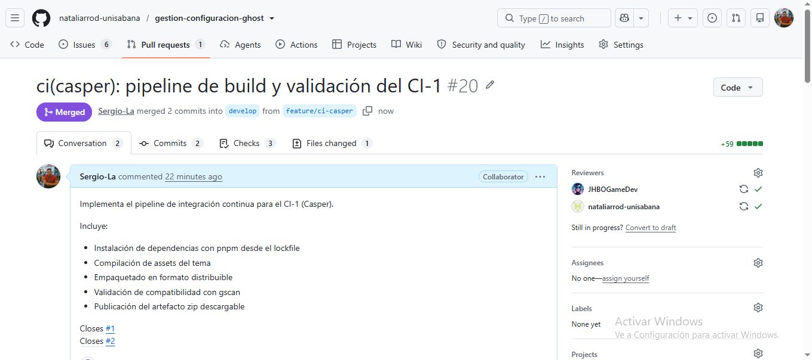
*El cambio integrado a `develop`, con los revisores que lo autorizaron
identificables en el registro.*

---

## 10. Mejoras de evolución y mantenimiento

Esta sección documenta el reto de mejora del sistema: cómo mejorar la calidad y
sostenibilidad de Ghost mediante estrategias de mantenimiento y evolución,
aplicadas sobre la arquitectura descrita en las secciones anteriores.

### 10.1 Diagnóstico y oportunidades identificadas

Sobre la arquitectura implementada en la Unidad 3, el equipo identificó cinco
oportunidades de mejora concretas, cada una con una línea base medible:

| Oportunidad detectada | Evidencia de la línea base |
|---|---|
| Duplicación entre `ci-casper.yml` y `ci-source.yml` | 37 de 46 líneas idénticas entre ambos archivos |
| El control de commits no exigía el issue que la convención declaraba obligatorio | Commits válidos según el control, sin referencia a issue |
| Dependencias desactualizadas sin monitoreo | 5 dependencias desactualizadas en cada tema (10 en total) |
| Versionamiento completamente manual | Los releases v1.0.0 y v1.0.1 se publicaron a mano, sin propuesta automática |
| Acciones externas fijadas a una versión, no a un commit | 0 de 9 acciones referenciadas por hash inmutable |

Ninguna de estas oportunidades se identificó de forma aislada: todas emergieron
de revisar el propio proceso de mantenimiento del repositorio construido en la
Unidad 3, una vez que ese proceso llevaba suficiente actividad real para
mostrar sus puntos débiles.

### 10.2 Estrategias propuestas

Cada mejora se evaluó contra los mismos cuatro criterios de ingeniería
aplicados en el resto del proyecto: si el control resultante era ejecutable, si
preservaba la decisión humana, si se adaptaba al contexto del equipo, y qué
costo se aceptaba al adoptarlo. Dos de las cinco corresponden directamente a
las estrategias de refactorización y modernización que exige la actividad; las
otras tres extienden el mismo principio a mantenimiento preventivo y a
automatización.

| Intervención | Clasificación | Alternativa evaluada y descartada |
|---|---|---|
| Workflow reutilizable | Perfectivo · Refactorización (Fowler, 2018) | Dejar la duplicación como estaba |
| Commitlint | Modernización | Parchar el script de bash propio |
| Dependabot | Preventivo · adaptativo | Revisión manual periódica |
| release-please | Automatización de versionamiento | semantic-release y changesets |
| Fijado a SHA de acciones | Preventivo · seguridad de cadena de suministro | Confiar en el tag de versión |

### 10.3 Implementación

**Refactorización del workflow de temas.** Aplicando el catálogo de Fowler
(2018), se combinaron `ci-casper.yml` y `ci-source.yml` mediante dos técnicas:
*Extract Function*, que traslada la lógica común de build, empaquetado y
validación con gscan a un único workflow reutilizable (`theme-ci.yml`), y
*Parameterize Function*, que absorbe la única diferencia real entre ambos, el
nombre del tema, en un parámetro de entrada (`workflow_call` con el input
`theme`). Cada archivo delgado resultante conserva sus propios filtros por
ruta, de modo que la independencia entre CI-1 y CI-2 no se pierde.

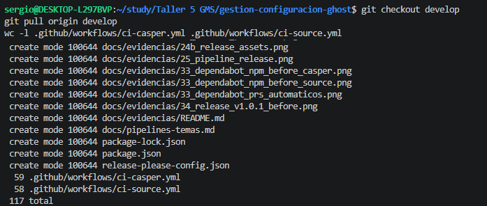

*92 líneas totales, 37 duplicadas entre los dos pipelines de temas.*

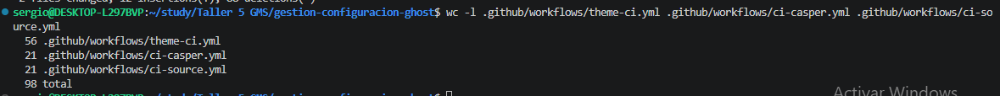
*77 líneas totales, 0 duplicadas: la lógica común vive en un solo lugar.*

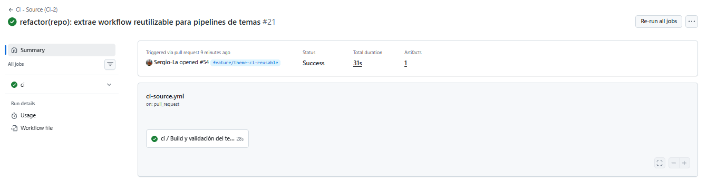
*`theme-ci.yml` ejecutándose con éxito, invocado desde `ci-casper.yml`.*

[Ver el diff completo del pull request de refactorización](https://github.com/nataliarrod-unisabana/gestion-configuracion-ghost/pull/33/files)

**Modernización de la validación de commits.** El script de bash con expresión
regular fue reemplazado por [`commitlint`](https://commitlint.js.org), el
estándar de la industria para Conventional Commits. La configuración
(`commitlint.config.js`) incorpora la regla nativa `references-empty`, que
cierra la brecha detectada de forma independiente por el equipo y por el
agente de IA: exigir el número de issue que la convención ya declaraba
obligatorio.

```javascript
rules: {
  'references-empty': [2, 'never'],
}
```

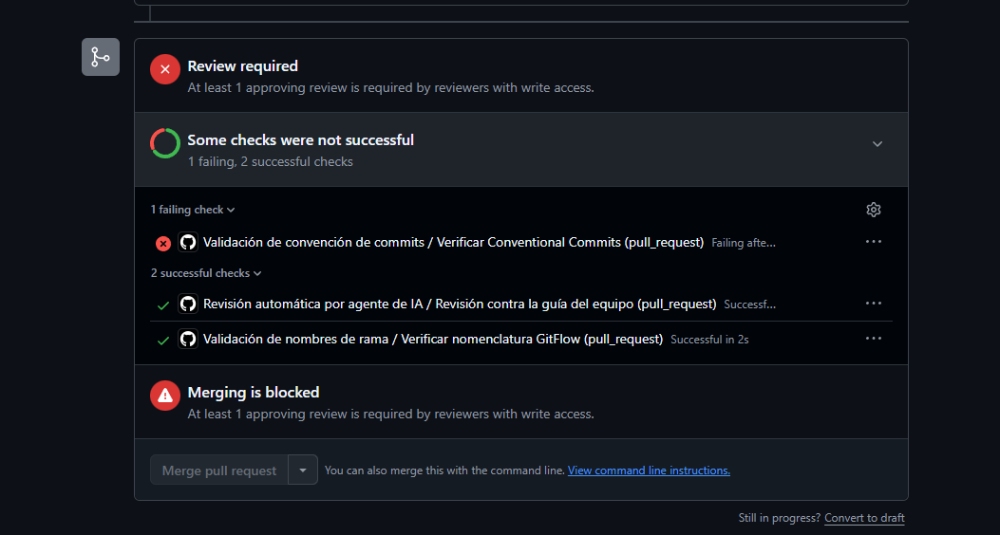
*commitlint rechazando un commit que no referencia ningún issue.*

**Dependabot para dependencias npm y GitHub Actions.** Se configuró
`.github/dependabot.yml` para vigilar semanalmente las dependencias de ambos
temas y, más adelante, también las acciones externas usadas en los workflows.
Cada actualización llega como un pull request ordinario, sujeto al mismo
control de cambios que cualquier contribución humana.

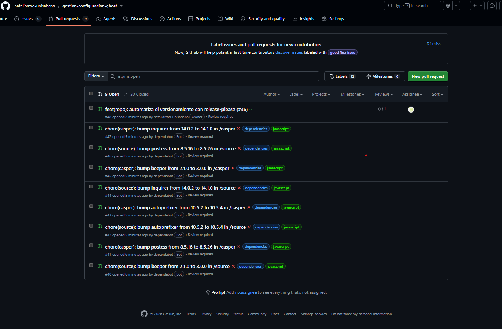
*Ocho pull requests abiertos automáticamente, uno por cada dependencia
desactualizada detectada.*

**Automatización del versionamiento con release-please.** Se evaluaron tres
herramientas: `semantic-release` publica directamente al detectar un commit
que amerita nueva versión, sin paso de revisión; `changesets` es la que usa el
propio Ghost, pero está diseñada para publicar paquetes a un registro npm, que
no es el caso de este repositorio. Se adoptó
[`release-please`](https://github.com/googleapis/release-please), la única de
las tres que propone la versión en un pull request sujeto a aprobación humana
en lugar de publicar directamente, preservando el criterio de decisión humana
aplicado en todo el proyecto.

El resultado más reciente de esta automatización es la versión
[**v1.2.0**](https://github.com/nataliarrod-unisabana/gestion-configuracion-ghost/releases/tag/v1.2.0),
propuesta íntegramente por release-please en el
[pull request #77](https://github.com/nataliarrod-unisabana/gestion-configuracion-ghost/pull/77),
con su changelog generado a partir del historial de Conventional Commits, y
publicada con sus artefactos adjuntos tras la aprobación del equipo.

**Fijado a SHA de las acciones externas.** Las nueve acciones externas
utilizadas en los seis workflows que las referencian quedaron fijadas a su
hash de commit exacto en vez de a una etiqueta de versión, siguiendo la misma
lógica de riesgo que la vulnerabilidad detectada por el agente en la sección 8:
un tag no es inmutable, y su mantenedor puede recrearlo apuntando a otro
commit sin que el equipo se entere.

```yaml
# Antes
uses: actions/checkout@v4

# Despues
uses: actions/checkout@11d5960a326750d5838078e36cf38b85af677262 # v4.4.0
```

[Ver el diff con los nueve hashes aplicados](https://github.com/nataliarrod-unisabana/gestion-configuracion-ghost/pull/56/files)

### 10.4 Evaluación del impacto

| Intervención | Antes | Después |
|---|---|---|
| Workflow reutilizable | 92 líneas, 37 duplicadas | 77 líneas, 0 duplicadas |
| Commitlint | Issue no exigido | Issue obligatorio |
| Dependabot | 10 dependencias desactualizadas | 8 pull requests automáticos |
| release-please | Versionamiento manual | Propuesto y aprobado |
| Fijado a SHA | 0 de 9 acciones inmutables | 9 de 9 acciones inmutables |

La evidencia más concluyente del impacto conjunto de estas cinco mejoras es que
la cadena completa de un cambio en el código a una versión publicada hoy,
ocurre sin intervención manual más allá de la aprobación: un pull request de
release-please, aprobado por el equipo, dispara la construcción de artefactos
y publica el release automáticamente. Antes de esta unidad, cada uno de esos
pasos se hacía a mano.

### 10.5 Desafíos encontrados durante la implementación

Dos incidentes reales, no anticipados en el diseño original, surgieron al
poner a funcionar las cinco mejoras juntas, y se documentan aquí porque son
evidencia de que las automatizaciones se validaron en producción, no solo en
el papel.

**Commitlint rompía los pull requests de Dependabot.** La regla
`references-empty`, exigida a todo commit, no distinguía entre commits humanos
y commits generados por Dependabot, que nunca referencian un issue. Los ocho
pull requests automáticos de la mejora anterior quedaron fallando el control
de convención de commits.

[Ver la corrida que muestra el rechazo exacto](https://github.com/nataliarrod-unisabana/gestion-configuracion-ghost/actions/runs/32921580256/job/98036038067?pr=63)
*`references may not be empty` sobre un commit generado por Dependabot.*

Se corrigió excluyendo específicamente al actor `dependabot[bot]` de este
control, sin debilitar la regla para las personas, el mismo patrón que ya
existía en `branch-lint.yml` para el mismo tipo de conflicto.

```yaml
jobs:
  commitlint:
    if: github.actor != 'dependabot[bot]'
```

[Ver el pull request de la corrección](https://github.com/nataliarrod-unisabana/gestion-configuracion-ghost/pull/65)

**release-please no disparaba la publicación de artefactos.** Por diseño de GitHub, ningún recurso creado con el GITHUB_TOKEN por defecto (incluido el tag que release-please publica al mergear su propio pull request) dispara otros workflows. Y release.yml, el encargado de construir y adjuntar los artefactos, depende exactamente de ese evento (push: tags: ['v*']) para activarse. Como resultado, el primer release automático se habría publicado sin los paquetes de Casper y Source.

> `release-please failed: GitHub Actions is not permitted to create or approve pull requests.`

Se corrigió sin introducir un token de acceso personal nuevo: un paso adicional
con `actions/github-script` dispara `release.yml` explícitamente vía
`workflow_dispatch`, usando el tag que release-please acaba de crear.

[Ver el pull request de la corrección](https://github.com/nataliarrod-unisabana/gestion-configuracion-ghost/pull/67)

Un tercer detalle, más sutil, apareció en el mismo proceso: `release-please`,
al no recibir el parámetro `target-branch` de forma explícita, abría su
propuesta de versión contra la rama por defecto configurada en GitHub
(`develop`) en vez de contra la rama que en realidad disparaba el workflow
(`main`). Se corrigió agregando `target-branch: main` explícitamente a la
configuración de la acción.

[Ver el pull request de la corrección](https://github.com/nataliarrod-unisabana/gestion-configuracion-ghost/pull/75)


---

## 11. Brechas identificadas

El equipo documenta a continuación diferencias conocidas entre las políticas
declaradas y los controles implementados, así como brechas que se detectaron y
cerraron durante el proyecto. Se dejan registradas de forma deliberada, sea
que sigan abiertas o que ya se hayan resuelto, porque la trazabilidad de cómo
se descubrió y se atendió cada una es tan relevante como el estado final.

**El control de commits no exigía el identificador de issue: brecha cerrada.**
Hasta la Unidad 3, `commit-lint.yml` validaba el tipo, el alcance y una
longitud mínima de descripción, pero aceptaba mensajes sin la referencia
`(#N)` que la convención declara obligatoria. Esta brecha, detectada de forma
independiente por el equipo y por el agente de IA, se cerró en la Unidad 4
reemplazando el script propio por `commitlint` con la regla nativa
`references-empty` (sección 10.3).

**El mensaje del control de ramas promete más de lo que verifica.** La ayuda
que muestra `branch-lint.yml` indica un formato `release/v<X.Y.Z>` para las
ramas de versión, mientras que el patrón acepta cualquier texto después del
prefijo. Esta brecha permanece abierta: no representa un riesgo de seguridad,
solo un mensaje de error impreciso, y no se corrigió dentro del alcance de
esta actividad.

**El agente de IA no analiza la validez estructural de YAML.** El agente
evalúa el contenido de un cambio contra las reglas declaradas en
`.gemini/styleguide.md`, pero no sustituye una validación estructural
especializada. Un job con una estructura YAML incorrecta no fue señalado por
el agente en una revisión, evidenciando el límite de su alcance: evalúa
contenido contra reglas, no sintaxis.

**El pull request de release mezcla configuration items por diseño.** La regla
de independencia de CI aplica al desarrollo cotidiano; el acto de release, por
su naturaleza, consolida en un mismo pull request el trabajo ya integrado de
los tres CI. El agente señaló repetidamente pull requests de este tipo como no
conformes, y el equipo evaluó la observación como un límite esperado del
propio proceso de liberación de versiones, no como un defecto a corregir.

Estas brechas, cerradas o abiertas, comparten un mismo origen: automatizar un
proceso expone fricciones que solo se manifiestan cuando el sistema completo
está en marcha, no cuando cada pieza se diseña por separado. Identificarlas y
documentarlas, en lugar de ocultarlas, es parte del mismo principio que rige
todo el proyecto: una política de configuración solo es un control cuando se
ejecuta, bloquea, y deja registro de lo que encuentra, incluidos sus propios
límites.

---

## 12. Evidencias

El detalle completo de las evidencias, con su descripción individual, está en el
índice de [`docs/evidencias/README.md`](docs/evidencias/README.md). Las capturas
más representativas de cada criterio se incluyeron directamente en las secciones
anteriores, junto al argumento que respaldan.

---

## 13. Referencias

Berczuk, S., & Appleton, B. (2002). *Software configuration management patterns*. Addison-Wesley.

IEEE. (2012). *IEEE Std 828-2012: Standard for configuration management in systems and software engineering*. IEEE.

Kim, G., Willis, J., Debois, P., & Humble, J. (2016). *The DevOps handbook*. IT Revolution Press.

TryGhost. (s.f.-a). *Casper* [Repositorio]. GitHub. https://github.com/TryGhost/Casper

TryGhost. (s.f.-b). *Ghost* [Repositorio de monorepo]. GitHub. https://github.com/TryGhost/Ghost

TryGhost. (s.f.-c). *Source* [Repositorio]. GitHub. https://github.com/TryGhost/Source
