# Gestión de Configuración y Automatización sobre Ghost

Implementación de una estrategia de control de versiones y automatización (DevOps)
sobre tres configuration items del sistema Ghost.

**Universidad de La Sabana**
Gestión de Configuración y Mantenimiento de Software
Docente: César Augusto Vega Fernández

**Equipo:** Natalia Rodríguez, Jose Haider Barreto, Sergio López

---

## 1. Introducción

Este repositorio implementa la estrategia de gestión de configuración diseñada en
las unidades anteriores del curso, llevándola de un plan documental a controles
automatizados y verificables sobre un sistema real.

El trabajo se apoya en dos entregas previas. En la Unidad 1 se realizó el
diagnóstico de mantenimiento y evolución de Ghost, donde se identificaron como
problemas principales la migración inconclusa de su panel de administración entre
dos frameworks de frontend, los cambios recurrentes en los requisitos de versión
de Node.js sin ventanas de compatibilidad solapadas, y el acoplamiento con la
versión de la base de datos. En la Unidad 2 se diseñó el plan de gestión de
configuración siguiendo el estándar IEEE 828-2012, identificando los
configuration items del sistema, sus baselines, el proceso de control de cambios
y los mecanismos de trazabilidad.

Esta tercera unidad materializa ese plan. El reto abordado es cómo implementar
una estrategia de control de versiones y automatización que permita gestionar
eficientemente la evolución del software, y la respuesta que propone este
repositorio consiste en llevar las políticas acordadas por el equipo a controles
ejecutables: pipelines que validan, bloquean y publican de forma automática, sin
depender de que cada integrante recuerde las reglas.

**Estado del repositorio antes de iniciar el trabajo:**

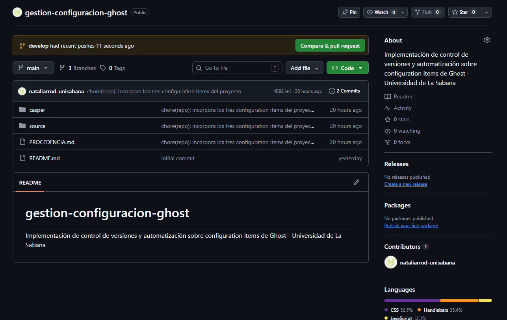
*Tres ramas, cero tags, ningún release publicado. Es la baseline de comparación
del resto de este documento.*

---

## 2. Configuration items gestionados

Se gestionan tres configuration items de naturaleza distinta, lo que permite
demostrar que la estrategia se adapta a artefactos con ciclos de vida diferentes.

| CI | Carpeta | Tipo | Responsable |
|----|---------|------|-------------|
| CI-1 | `casper/` | Tema de Ghost | Sergio López |
| CI-2 | `source/` | Tema de Ghost | Jose Haider Barreto |
| CI-3 | `config-entorno/` | Infraestructura como código | Natalia Rodríguez |

**CI-1 y CI-2** son los dos temas oficiales de Ghost. En el monorepo del proyecto
figuran como submódulos de Git, es decir, como codelines de terceros según la
terminología de Berczuk y Appleton (2002). Ambos conservan su versionamiento
semántico propio, heredado del proyecto original: Casper en la versión 5.12.1 y
Source en la 1.7.1.

**CI-3** es de elaboración propia y responde directamente a una brecha detectada
en el diagnóstico de la Unidad 2: Ghost no publica una plantilla versionada que
declare qué variables de entorno son obligatorias en cada versión mayor. Esa
ausencia contribuye a los fallos de despliegue documentados en la Unidad 1, donde
actualizaciones de infraestructura se realizan sin conocer los requisitos exactos
de la versión instalada.

La procedencia detallada de cada CI está documentada en
[`PROCEDENCIA.md`](PROCEDENCIA.md).

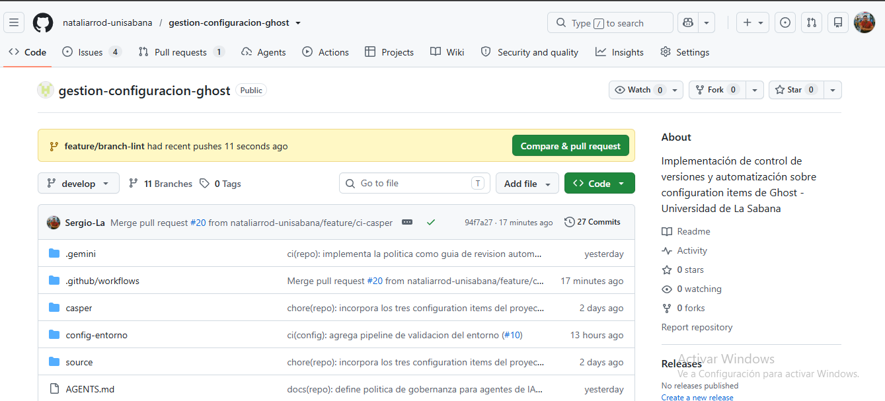
*Los tres configuration items conviviendo en el repositorio, cada uno en su
propia carpeta.*

---

## 3. Estructura del repositorio

```
gestion-configuracion-ghost/
├── casper/                  CI-1: tema por defecto de Ghost
├── source/                  CI-2: segundo tema oficial de Ghost
├── config-entorno/          CI-3: infraestructura como código
│   ├── .env.example         Plantilla versionada de variables
│   ├── .gitignore           Impide versionar valores reales
│   ├── Dockerfile           Imagen con versiones fijadas
│   ├── compose.yaml         Servicios de Ghost y MySQL
│   └── scripts/
│       └── validate-env.sh  Validación de variables requeridas
├── .github/workflows/       Los seis pipelines de CI/CD
├── .gemini/
│   └── styleguide.md        Guía de revisión para el agente de IA
├── docs/
│   ├── pipelines-temas.md   Documentación técnica de los CI-1 y CI-2
│   └── evidencias/          Capturas de la ejecución real
├── AGENTS.md                Política de gobernanza para agentes de IA
├── PROCEDENCIA.md           Origen y versión base de cada CI
└── README.md                Este documento
```

---

## 4. Estrategia de branching

Se adoptó **GitFlow** como estrategia de ramificación.

```
main                    Versiones publicadas. Rama protegida.
 └── develop            Integración continua. Rama protegida.
      ├── feature/*     Trabajo nuevo
      └── ...
 └── release/vX.Y.Z     Preparación de versión
 └── hotfix/*           Correcciones urgentes sobre main
```

### Justificación de la elección

Ghost, el proyecto del que provienen dos de los tres CI, utiliza GitHub Flow: una
única rama principal con ramas de característica de vida corta. Esa elección es
coherente con su contexto, ya que se trata de un proyecto de código abierto con
contribuciones externas continuas y despliegue frecuente, donde reducir la
fricción de integración es prioritario.

El equipo optó deliberadamente por GitFlow en lugar de replicar esa práctica. La
razón es que el objeto de trabajo es distinto: aquí se gestionan artefactos
versionados y publicados por lotes, con releases identificables, donde el
aislamiento que ofrece una rama de preparación de versión aporta un punto de
control adicional antes de publicar. Esta decisión ilustra un principio del
propio estándar IEEE 828 (IEEE, 2012): la estrategia de configuración se adapta
al contexto del proyecto y no se hereda automáticamente del sistema analizado.

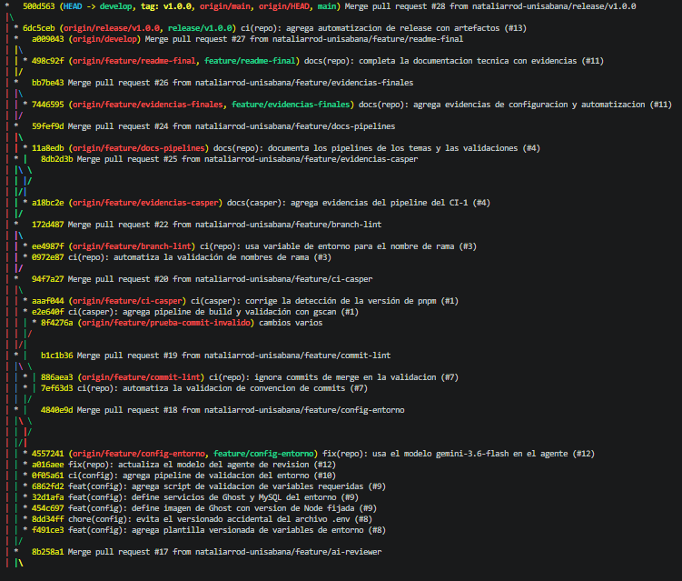
*Historial completo con las ramas de característica convergiendo en `develop` y
los commits de merge visibles.*

### Protección de ramas

Tanto `main` como `develop` están protegidas mediante rulesets que exigen pull
request con al menos una aprobación antes de integrar. Ningún integrante, incluida
la propietaria del repositorio, puede realizar push directo sobre ellas. Esto
convierte la estrategia de branching en un control efectivo y no en una
declaración documental.

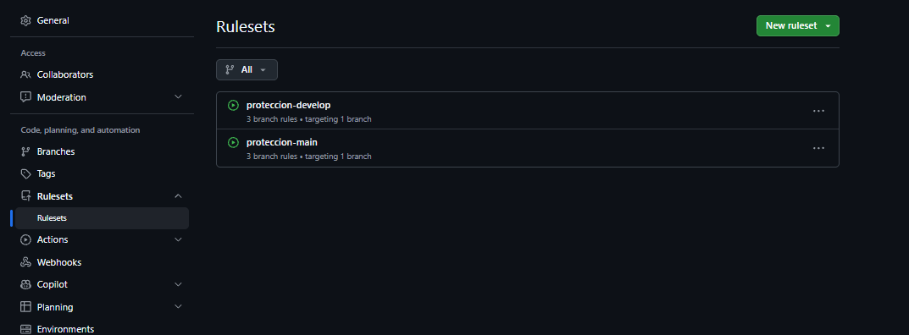
*Los rulesets `proteccion-main` y `proteccion-develop`, ambos activos.*

La nomenclatura de las ramas no queda librada a la disciplina individual: el
pipeline `branch-lint.yml` la verifica automáticamente en cada pull request y
bloquea la integración cuando un nombre no cumple el patrón acordado.

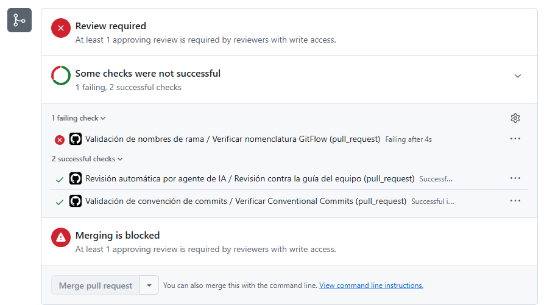
*El control rechazando un nombre de rama que no sigue la convención `feature/`,
`release/` o `hotfix/`.*

---

## 5. Versionamiento semántico

El repositorio se versiona como conjunto mediante tags `vX.Y.Z`:

| Componente | Criterio | Ejemplo |
|------------|----------|---------|
| MAYOR | Cambio que rompe compatibilidad | Modificar la versión mínima de Node.js requerida |
| MENOR | Funcionalidad nueva sin romper compatibilidad | Incorporar un nuevo configuration item |
| PARCHE | Corrección sin cambio funcional | Ajustar un paso de un pipeline existente |

Coexisten dos niveles de versionamiento, lo cual es en sí mismo un hallazgo
relevante: el repositorio del equipo mantiene su propia secuencia de versiones,
mientras que cada tema conserva la suya, heredada de Ghost. Esto refleja lo
señalado en la Unidad 2 sobre configuration items con ciclos de vida
independientes, donde el ritmo de publicación de un componente no está atado al
del conjunto que lo contiene.

La primera versión publicada es **v1.0.0**, que marca la baseline del estado
completo de la implementación.

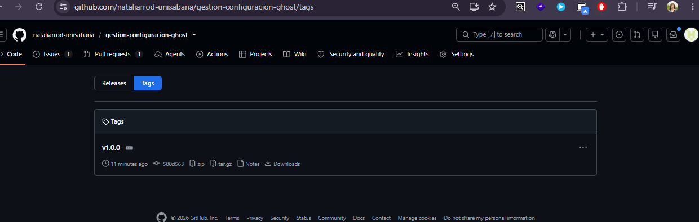
*El tag publicado en el repositorio.*

El proceso de publicación está automatizado en `release.yml`, que al detectar un
tag construye los artefactos de ambos temas y crea la release con los paquetes
adjuntos.

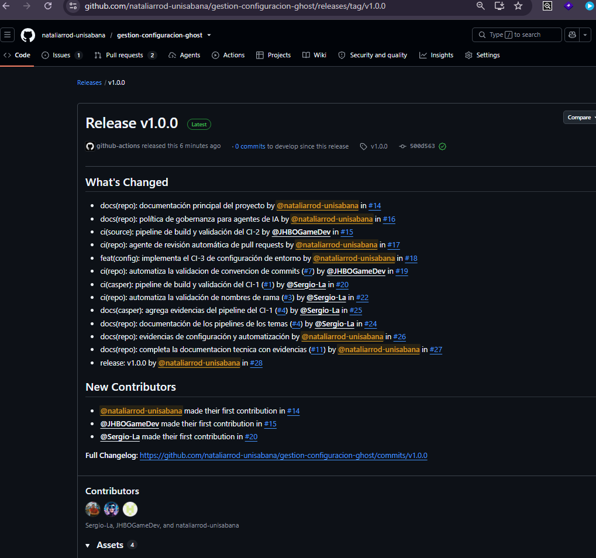
*La release v1.0.0 con `casper.zip` y `source.zip` disponibles para descarga.*

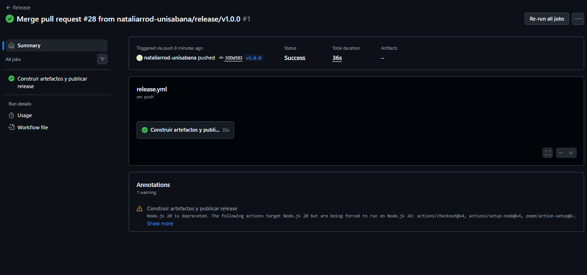
*Ejecución del workflow de release disparada automáticamente por el tag.*

---

## 6. Convención de commits

Se adoptó **Conventional Commits** con el siguiente formato:

```
<tipo>(<alcance>): <descripción> (#<issue>)
```

| Elemento | Valores permitidos |
|----------|-------------------|
| Tipo | `feat`, `fix`, `docs`, `ci`, `build`, `test`, `refactor`, `chore` |
| Alcance | `casper`, `source`, `config`, `docs`, `repo` |
| Issue | Número del issue asociado |

Ejemplo:

```
ci(config): agrega pipeline de validación del entorno (#10)
```

La referencia al número de issue es el mecanismo central de trazabilidad del
proyecto: vincula cada cambio en el código con la solicitud que lo originó, con
la discusión asociada y con la aprobación que lo autorizó.

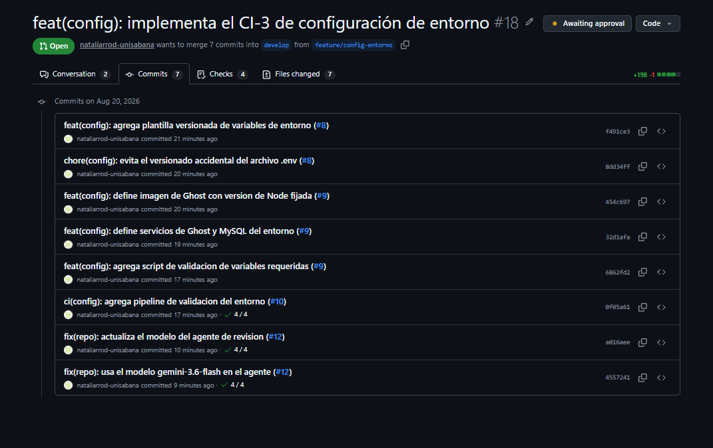
*Siete commits del CI-3, cada uno con propósito único y su issue asociado.*

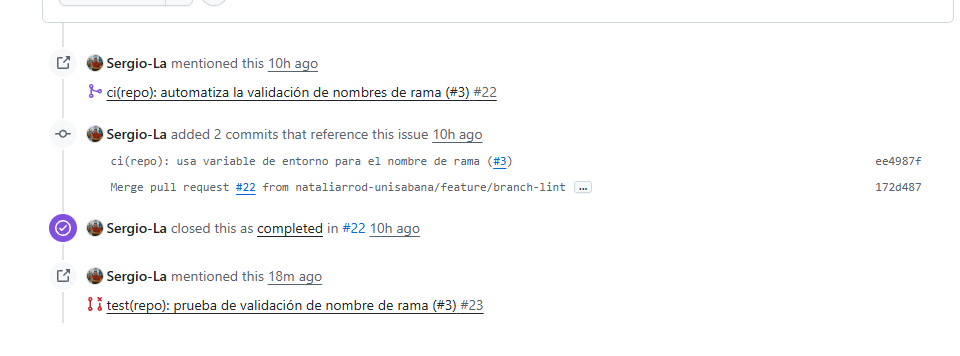
*Un issue vinculado a sus commits, al pull request que lo resuelve, y cerrado
automáticamente al integrarse.*

El pipeline `commit-lint.yml` verifica el cumplimiento del formato y bloquea la
integración cuando algún commit no lo respeta.

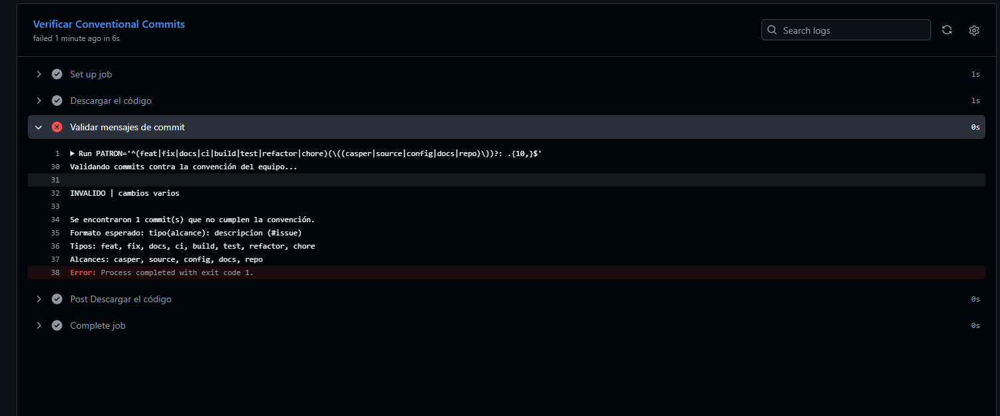
*Log del rechazo de un commit con el mensaje "cambios varios", indicando el
formato esperado.*

---

## 7. Pipelines de integración y entrega continua

El repositorio cuenta con seis workflows de GitHub Actions.

| Workflow | Función | CI asociado |
|----------|---------|-------------|
| `ci-casper.yml` | Build, empaquetado y validación con gscan | CI-1 |
| `ci-source.yml` | Build, empaquetado y validación con gscan | CI-2 |
| `ci-config-entorno.yml` | Análisis del Dockerfile, sintaxis del compose y validación de variables | CI-3 |
| `branch-lint.yml` | Verificación de la nomenclatura de ramas | Todos |
| `commit-lint.yml` | Verificación de la convención de commits | Todos |
| `release.yml` | Publicación de la versión con sus artefactos | Todos |

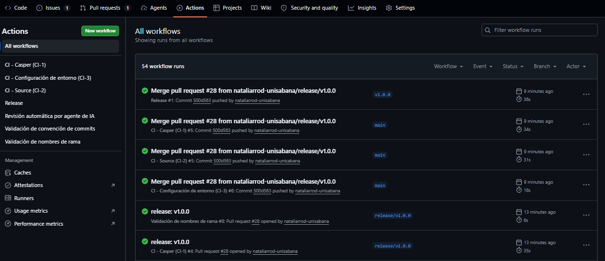

*Los seis pipelines en la pestaña Actions del repositorio.*

### Dos categorías de automatización

Los pipelines del proyecto responden a dos propósitos distintos.

Los tres primeros son **controles técnicos**: compilan, empaquetan y validan que
cada artefacto sea correcto según las reglas de su propia tecnología. Cada uno se
activa únicamente cuando cambia la carpeta de su configuration item, mediante
filtros por ruta, lo que mantiene la independencia entre los CI y evita
ejecuciones innecesarias.

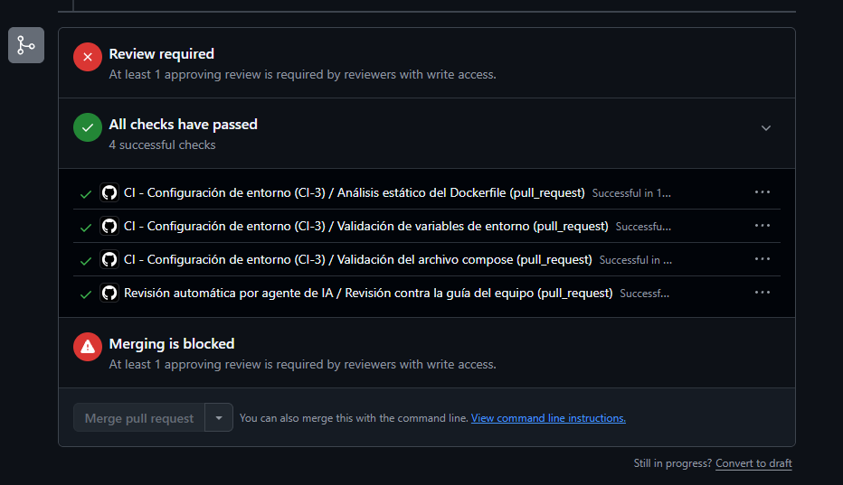
*Los tres jobs del CI-3 y el del agente de IA, todos exitosos.*

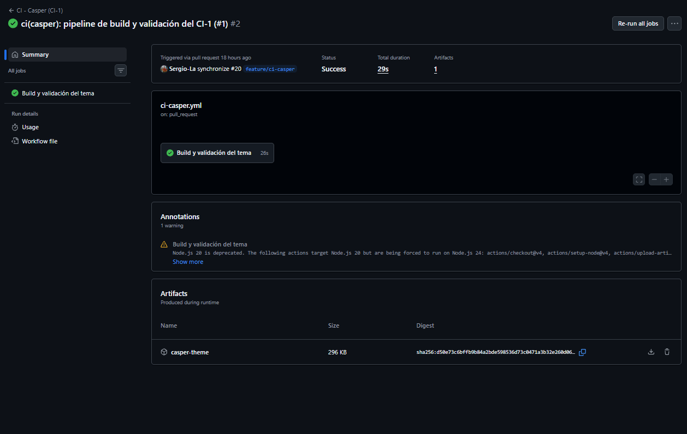
*El artefacto `casper-theme` generado y disponible para descarga.*

Los pipelines `branch-lint` y `commit-lint` son **controles de política**: no
verifican el artefacto sino el cumplimiento de las reglas que el propio equipo
definió. Esta distinción es relevante desde la perspectiva de gestión de
configuración, porque convierte acuerdos documentales en restricciones ejecutables.
Una convención escrita en un documento depende de que cada persona la recuerde y
la aplique; la misma convención implementada como pipeline se cumple siempre, y
su incumplimiento queda registrado. Es la diferencia entre un control preventivo
declarado y uno efectivo.

El caso del CI-3 incorpora además un **caso negativo deliberado**: el pipeline no
solo verifica que el script de validación acepte un archivo de variables completo,
sino que comprueba que efectivamente rechace uno incompleto. Una automatización
que solo se prueba en el escenario favorable no demuestra que controle nada.

La documentación técnica detallada de los pipelines de los temas está en
[`docs/pipelines-temas.md`](docs/pipelines-temas.md).

---

## 8. Gobernanza de agentes de IA

El repositorio incorpora una política explícita sobre la participación de agentes
de inteligencia artificial en el flujo de trabajo, documentada en
[`AGENTS.md`](AGENTS.md), y la implementa como control ejecutable.

### El planteamiento

El punto de partida es una observación del propio proyecto Ghost: sus
repositorios ya incluyen archivos de documentación dirigidos a agentes
automatizados. Desde la perspectiva de gestión de configuración, esto plantea una
pregunta que el estándar IEEE 828 no anticipa, ya que un agente capaz de proponer
o modificar código es un actor dentro del proceso de control de cambios y, por
tanto, requiere un rol y unos permisos definidos igual que un desarrollador
humano.

La política adoptada permite que los agentes revisen y sugieran, pero reserva a
las personas la autoridad de aprobación e integración.

### La implementación

Se implementó un workflow propio, `ai-review.yml`, que en cada pull request envía
el conjunto de cambios y la guía de revisión del equipo a un modelo de lenguaje, y
publica el resultado como comentario. Tres decisiones de diseño traducen la
política a comportamiento verificable:

- **El agente comenta pero no aprueba.** Publica un comentario de conversación y
  no una revisión con estado de aprobación, de modo que no puede satisfacer el
  requisito de aprobación de las reglas de protección de rama.
- **Su fallo no bloquea la integración.** Los errores se manejan como
  advertencias y nunca hacen fallar el job, porque su resultado es consultivo y
  no debe condicionar el merge.
- **Lee `.gemini/styleguide.md` en tiempo de ejecución.** Las reglas no están
  embebidas en el workflow, de modo que un cambio en las convenciones del equipo
  se refleja sin modificar el pipeline. Es la misma lógica de fuente única de
  verdad aplicada al control automatizado.

### Resultados y evaluación crítica

El agente produjo hallazgos de valor desigual, y su evaluación es parte del
proceso.

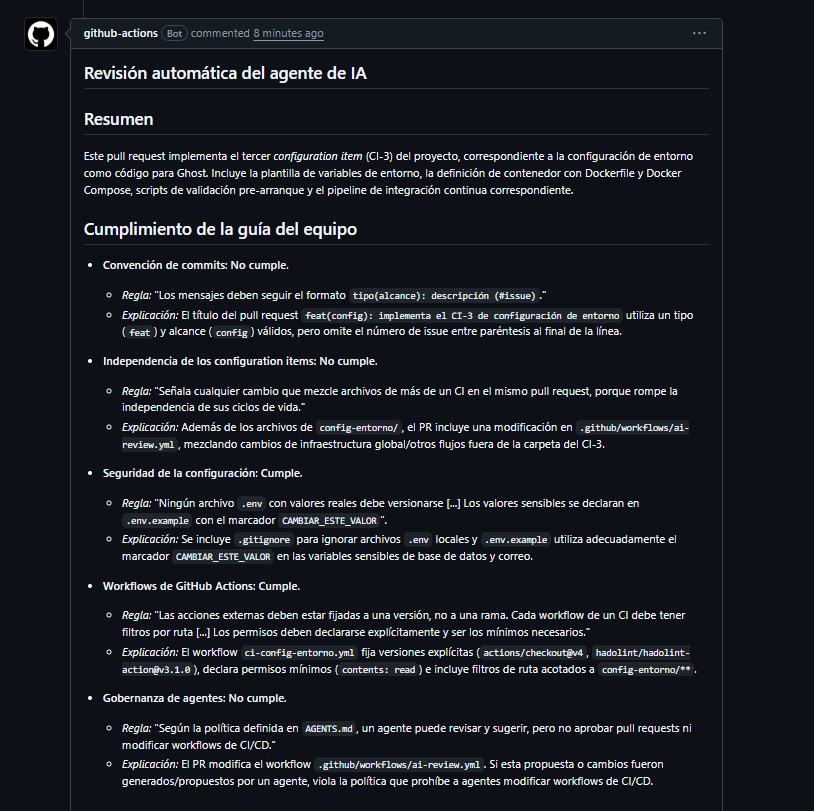
*El agente evaluando el CI-3 contra las cinco reglas del `styleguide.md`.*

El caso más significativo fue la detección de una vulnerabilidad de inyección de
comandos en `branch-lint.yml`, donde la expansión directa de una expresión de
contexto dentro de un script de shell habría permitido la ejecución de comandos
arbitrarios mediante un nombre de rama malicioso. El hallazgo incluía la
ubicación exacta y la corrección, que el equipo aplicó.

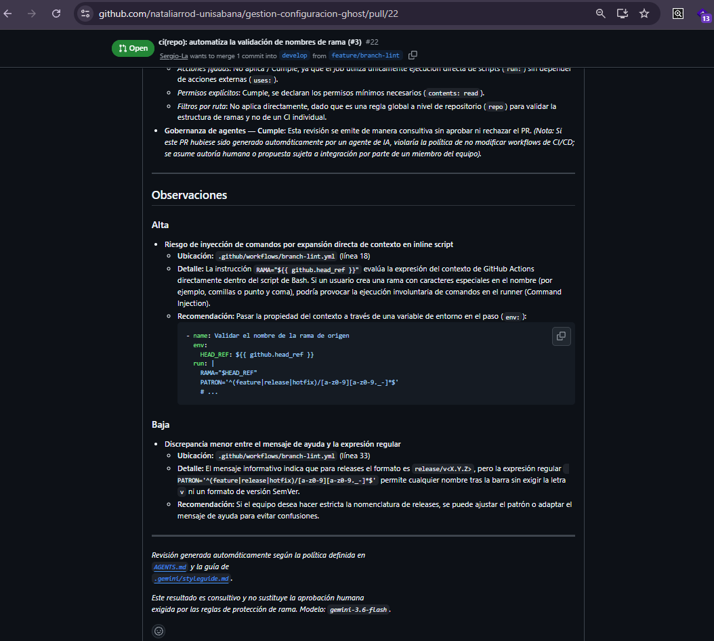
*El agente identifica la vulnerabilidad de inyección de comandos, su ubicación
exacta en el archivo y la corrección propuesta mediante una variable de entorno.*

Otros hallazgos requirieron discusión. El agente señaló repetidamente que los
títulos de los pull requests no incluían el número de issue, aplicando una regla
que rige los mensajes de commit y no los títulos. También advirtió sobre una
posible violación de la política de agentes al modificarse un workflow de CI/CD,
partiendo del supuesto no verificado de que el cambio hubiera sido generado por
un agente.

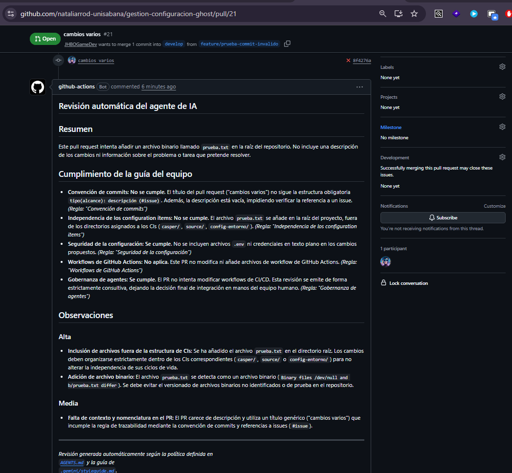
*El agente identificando múltiples incumplimientos en un pull request de prueba,
incluida la ausencia de estructura en su título y descripción.*

Esta diferencia entre hallazgos accionables y falsos positivos es precisamente lo
que justifica el carácter consultivo del control. Un equipo que acata
automáticamente toda salida de un agente no está ejerciendo gobernanza sobre él.

---

## 9. Modelo de gestión de configuración propuesto

El modelo aplica los patrones de Berczuk y Appleton (2002) sobre la arquitectura
concreta de este repositorio.

**Patrón Repository.** El repositorio es la fuente única de verdad para código,
configuración de entorno y definiciones de automatización. Los tres CI conviven
en él conservando su independencia funcional.

**Patrón Mainline.** Una única línea de desarrollo activa, `develop`, hacia la
que convergen todas las ramas de trabajo, protegida por los controles automáticos.

**Patrón Codeline Policy.** Las reglas de cada línea de código no quedan
únicamente documentadas sino implementadas: las ramas protegidas exigen revisión,
y los pipelines de validación verifican nomenclatura y formato de cada
contribución.

**Independencia de configuration items.** Cada CI mantiene su propio pipeline,
activado por filtros de ruta, de modo que un cambio en un tema no dispara la
validación de la infraestructura ni viceversa. Esto materializa el criterio de la
Unidad 2 sobre por qué cada elemento se identifica como un CI separado.

**Todo en control de versiones.** Siguiendo la práctica señalada por Kim et al.
(2016), el repositorio versiona no solo el código sino la definición del entorno
de ejecución, las reglas de calidad y las políticas del proceso.

**El control de cambios en la práctica:**

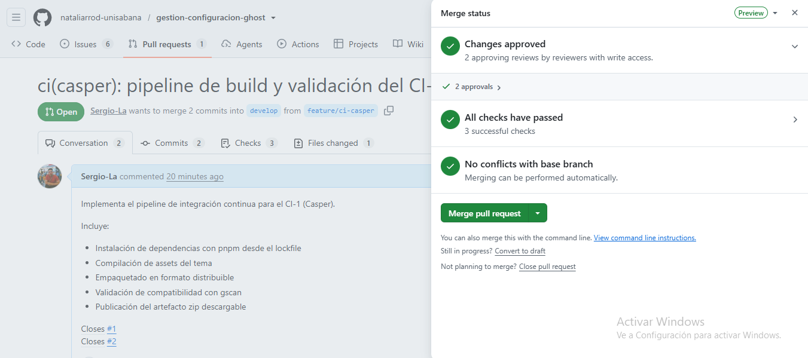
*Un pull request con dos aprobaciones humanas y todos los checks automatizados
en verde antes de integrarse.*

---

## 10. Brechas identificadas

El equipo documenta a continuación diferencias conocidas entre las políticas
declaradas y los controles implementados. Se dejan registradas de forma
deliberada, ya que corregirlas a esta altura implicaría invalidar contribuciones
ya integradas.

**El control de commits no exige el identificador de issue.** El patrón de
`commit-lint.yml` valida el tipo, el alcance y una longitud mínima de descripción,
pero acepta mensajes sin la referencia `(#N)` que la convención declara
obligatoria. La política es más exigente que su control.

**El mensaje del control de ramas promete más de lo que verifica.** La ayuda que
muestra `branch-lint.yml` indica un formato `release/v<X.Y.Z>` para las ramas de
versión, mientras que el patrón acepta cualquier texto después del prefijo.

Ambas brechas son del mismo tipo: un control automatizado que verifica menos de
lo que la política enuncia. Identificarlas tiene valor porque una automatización
que se asume más estricta de lo que es genera una falsa sensación de control.

---

## 11. Evidencias

El detalle completo de las evidencias, con su descripción individual, está en el
índice de [`docs/evidencias/`](docs/evidencias/README.md). Las capturas más
representativas de cada criterio se incluyeron directamente en las secciones
anteriores, junto al argumento que respaldan.

---

## 12. Referencias

Berczuk, S., & Appleton, B. (2002). *Software configuration management patterns*. Addison-Wesley.

IEEE. (2012). *IEEE Std 828-2012: Standard for configuration management in systems and software engineering*. IEEE.

Kim, G., Willis, J., Debois, P., & Humble, J. (2016). *The DevOps handbook*. IT Revolution Press.

TryGhost. (s.f.-a). *Casper* [Repositorio]. GitHub. https://github.com/TryGhost/Casper

TryGhost. (s.f.-b). *Ghost* [Repositorio de monorepo]. GitHub. https://github.com/TryGhost/Ghost

TryGhost. (s.f.-c). *Source* [Repositorio]. GitHub. https://github.com/TryGhost/Source
